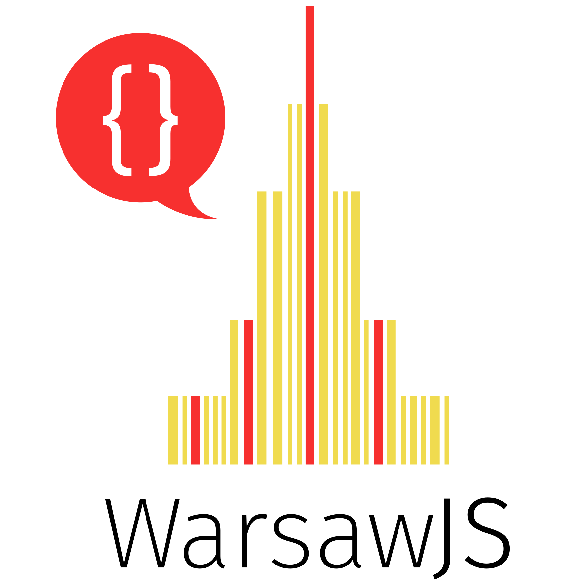

# WarsawJS Meetup: Slides template

:clipboard: Slides for `WarsawJS Meetup`

## Preview

<https://warsawjs.github.io/meetup-slides-template>

## :bulb: How to use this template?

1. For this project
2. Rename project at `GitHub` (with snake-case style)
3. Update `description` and `link` on GitHub repository profile
4. In `index.html`:
    + `<title>` & `<h1>` tags should have title of your talk
    + Update link to `"Fork me on GitHub"` at the bottom of document
5. In `README.md`:
    + Update main header (in first file)
    + Update `Preview` link
    + Remove this tutorial

## Organization logo

## Colors

* Yellow: `#f0db4f` (JavaScript Color)
* Red: `#f7302f` (WarsawJS Color)

## License

[The MIT License](http://en.wikipedia.org/wiki/MIT_License) @ 2018
